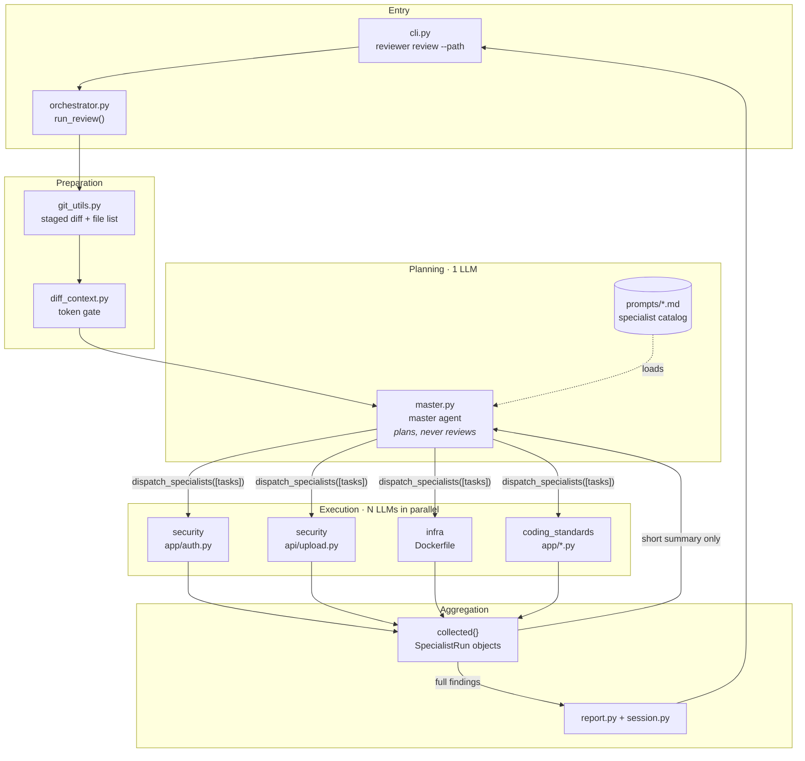
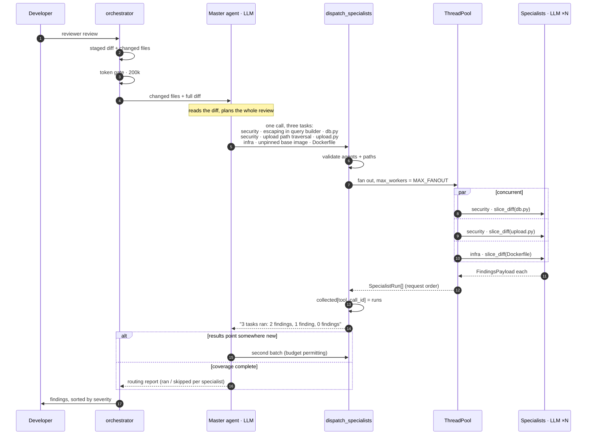
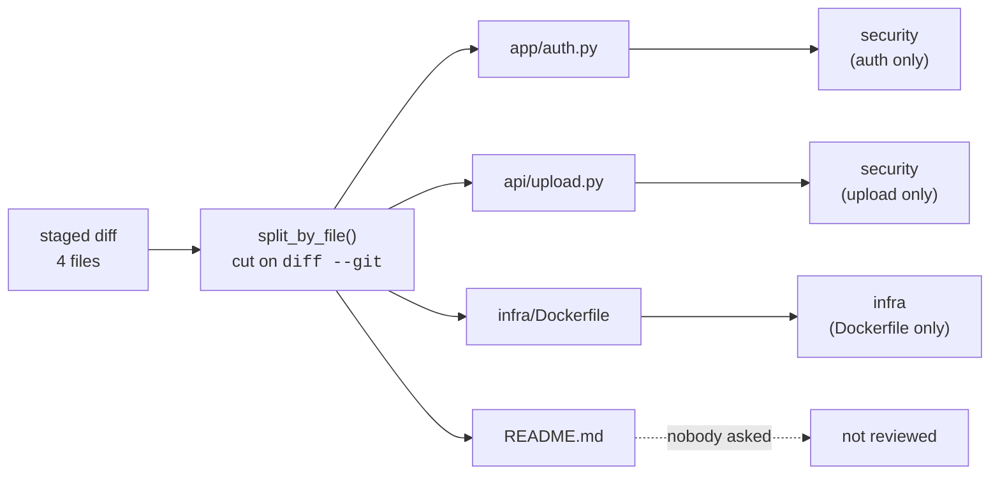
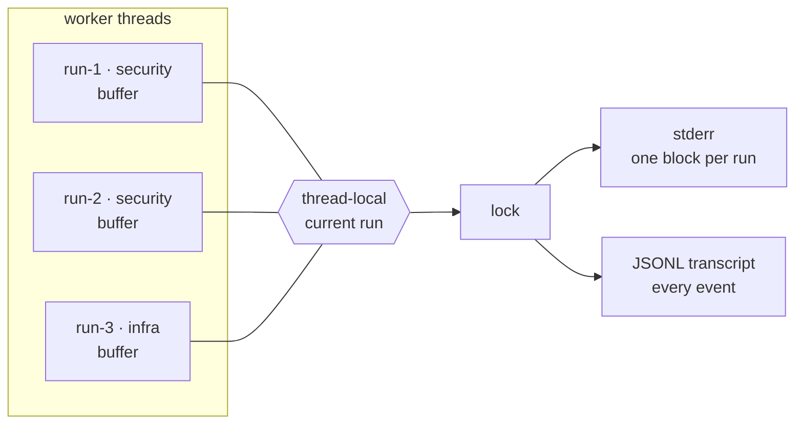

# Reviewer Architecture

A multi-agent code reviewer for staged git changes. A **master** agent plans the
review and splits it into scoped tasks; **specialist** agents execute those tasks
concurrently, each over only the slice of the diff it was assigned.

---

## 1. What changed in v0.2

The previous design gave the master one tool per specialist plus a generic
dispatcher — five tools reaching four fixed agents. Each call ran one specialist,
synchronously, over the entire diff. The prompt taught serial behaviour
("after a specialist returns, you may call another"), so a four-specialist review
was four sequential round-trips, each re-reading the whole change.

| | v0.1 | v0.2 |
|---|---|---|
| Tools exposed to master | 5 (4 named + 1 redundant) | **1** — `dispatch_specialists` |
| Calls per review | one per specialist, serial | **one batch**, parallel |
| Work unit | a specialist | a **task**: `(agent, task, files)` |
| Diff each specialist sees | the entire staged diff | **only its assigned files** |
| Task text from the LLM | `reason` (logged, then discarded) | `task` (**delivered to the agent**) |
| Same specialist twice | a "re-call" in a later turn | **many instances in one batch** |
| Cost profile | O(specialists × full diff) | ≈ O(full diff) |
| Repo tools | unrestricted filesystem access | **confined to the repo**, deny-list |

The catalog stays closed on purpose: the master picks from the curated `.md`
prompts, it does not author new agent personas. See §9.

---

## 2. System overview



The two arrows out of `collected` are the important detail. The master gets a
compact text summary; the actual `Finding` objects bypass it entirely and go
straight to the report. See §7.

---

## 3. The dispatch cycle



---

## 4. The dispatch contract

The master sees exactly one tool. This is the full model-facing schema:

```jsonc
{
  "name": "dispatch_specialists",
  "parameters": {
    "tasks": [{
      "agent": "string",   // must exist in the catalog
      "task":  "string",   // what to look for — delivered to the agent
      "files": ["string"]  // subset of changed files; empty = whole diff
    }]
  }
}
```

`tool_call_id` is injected server-side via `InjectedToolCallId` and is stripped
from the schema the model receives, so the model cannot set or spoof it.

**`agent`** — a key from `prompts/*.md`. Unknown names are rejected before any
LLM call is made.

**`task`** — the per-run instruction. In v0.1 the equivalent field (`reason`) was
written to a log line and never reached the specialist; the only steering channel
was `focus_hint`. Now the task text is appended to the specialist's user message:

```python
user_content = f"Review this staged diff:\n\n{diff_text}"
if task:
    user_content += f"\n\nYour assignment for this run: {task}"
```

**`files`** — the scoping key, and the field that makes the whole redesign pay
off. It must name paths that appear in this diff; anything else is dropped.

> **The same `agent` may appear several times in one batch.** That is the dynamic
> subagent creation: three security reviewers, each on a different area, rather
> than one reviewer holding three unrelated concerns at once. Agents are
> instantiated fresh per run (`create_agent` is called inside
> `run_subagent_review`), so instances are cheap and stateless.

---

## 5. Diff scoping

`slice_diff` is the mechanism that converts "more agents" from *more cost* into
*less context per agent*.



`split_by_file` cuts the unified diff at each `diff --git a/… b/…` header and
keys on the **post-image (`b/`) path**, which is what `git diff --name-only`
reports — including for renames, so scoping requests always match.

Sections are self-contained and concatenate back into a valid diff, which is why
`slice_diff` can just join the pieces the task asked for.

Two deliberate fallbacks: an empty `files` list means "no scoping requested" and
returns the whole diff; requesting paths that are all absent also returns the
whole diff. A specialist reviewing everything is wasteful, but one reviewing
nothing is useless.

**Side effect worth knowing:** each `Finding` stores `diff_context = diff_text`,
which is now the *scoped* diff. Session JSON used to carry one copy of the entire
staged diff per finding.

---

## 6. Concurrency model

Threads, not asyncio.

```python
workers = max(1, min(MAX_FANOUT, len(tasks)))
with ThreadPoolExecutor(max_workers=workers, thread_name_prefix="specialist") as executor:
    return list(executor.map(lambda task: _execute_task(...), tasks))
```

**Why threads.** Specialists block on network I/O, which releases the GIL, so
threads deliver real parallelism here. Going async would force `ainvoke` up
through `orchestrator` → `cli` → typer for no additional throughput.

**Why `executor.map`.** It returns results in *request order*, so the trace and
the report are deterministic regardless of which specialist finishes first.

**Why no lock.** The shared `collected` dict is written **once**, from the calling
thread, after every worker has joined:

```python
runs = _run_batch(accepted, specialists, diff_context, repo_root)
collected[tool_call_id] = runs   # all workers already joined
```

The workers never touch shared state — each returns a `SpecialistRun` value. The
race that a naïve fan-out would introduce is designed out rather than locked
around.

**Why the batch can't be killed by one agent.** `_execute_task` catches `LLMError`
and returns a `SpecialistRun` carrying `error`, so a failed specialist becomes a
reported failure instead of an exception that unwinds the pool.

---

## 7. Result plumbing

Two paths out of a batch, deliberately:

| Path | Content | Destination | Why |
|---|---|---|---|
| Tool return value | `"security [app/auth.py]: 2 finding(s): high: …"` | the master's context | keeps the router's context small; stops it editorializing over findings |
| `collected[tool_call_id]` | full `SpecialistRun` objects with `Finding` bodies | `_extract_result` → report | findings reach the developer verbatim, unfiltered by a second LLM |

`_extract_result` walks the message history, and for each dispatch call it
already has the runs keyed by `tool_call_id`. One call now expands to N trace
entries — one per task — each recording agent, task text, scope, finding count,
`is_recall`, and any error.

A dispatch call blocked by the budget middleware never lands in `collected`, so
it is skipped during extraction and `cap_reached` is set from the middleware's
error message instead.

---

## 8. Validation and guardrails

`_validate_tasks` runs **before** any LLM call, so bad plans cost nothing:

| Check | Behaviour |
|---|---|
| `agent` not in catalog | task rejected; available names returned to the master |
| `files` entry not in this diff | that path dropped; task runs on the rest |
| batch longer than `MAX_TASKS_PER_BATCH` | truncated, with a count of what was dropped |
| `tasks` empty | error string returned, nothing runs |

Rejections are **fed back to the master in the tool result**, not swallowed — so
it can correct a hallucinated agent name or path on the next batch rather than
silently losing that coverage.

### Repo tool sandbox

Specialists get `grep_tool`, `read_file_tool`, `list_dir_tool` — and these are
driven by an LLM whose input is an untrusted diff. Prompt-injected text in a
diff must not be able to reach a credential, so containment is enforced at the
tool boundary, not the prompt:

- every path is `resolve()`d and must be inside the repo root — `../`, absolute
  paths, and symlinks pointing outward are refused;
- a deny-list (`.git`, `.env`, `.ssh`, `.aws`, `.venv`, `node_modules`, …) is
  refused even *inside* the repo, and is skipped by `grep` and hidden by
  `list_dir`;
- `read_file` truncates at 2000 lines, `grep` at 50 matches.

---

## 9. Design decisions

**Fixed roles, dynamic instances.** The master composes *how many* specialists
run and *what each one is assigned*, but not *what a specialist is*. Letting an
LLM author a reviewer persona at runtime sounds more flexible and reviews worse:
the curated prompts in `prompts/` encode real domain checklists that an
improvised "you are a reviewer of X" cannot match. Flexibility comes from
instance count and task scoping instead.

**One tool, not five.** Five tools reaching four agents meant two doors into the
same room and no signature that made parallelism the obvious move. A single tool
whose parameter is a *list* makes batching the default reading of the schema.

**The master never sees findings.** It plans and reports routing. Findings are
aggregated separately and shown to the developer directly — a router that
summarizes its subagents adds a lossy paraphrase and a chance to invent.

**Adding a specialist is still a file drop.** Write `prompts/performance.md`
with `name` and `description` frontmatter; it appears in the catalog, the system
prompt, and the tool description automatically. No code change.

---

## 10. Tracing

Because specialists run concurrently, writing events to the terminal as they
occur interleaves four agents into noise. `tracer.py` buffers every event
against the run that produced it and flushes the whole block atomically when
that run finishes — with a `○` marker printed up front so progress stays
visible.



`tracer.tool_call(...)` and `tracer.finding(...)` are called deep inside a
specialist — in `tools.py` and `subagents/base.py` — with no idea which run they
belong to. The run is recovered from a `threading.local` set by
`tracer.run(agent, scope)` in `_execute_task`, so no context has to be threaded
through the call stack.

Terminal output:

```
◆ Code review · 3 files staged

  ▸ Dispatch · 4 tasks · 4 workers
  ○ security           app/auth.py
  ○ security           api/upload.py
  ○ infra              infra/Dockerfile
  ○ coding_standards   app/auth.py
  ✓ security           api/upload.py     1 finding   0.3s
      🔍 grep(pattern='execute\\(', path_glob='**/*.py') → 2 line(s)
      🔍 read_file(path='app/db.py', start=40, end=80) → 41 line(s)
      ▲ HIGH     Path traversal in filename handling  api/upload.py:31-38
  ✗ infra              infra/Dockerfile  failed: upstream 503  0.4s
      🔍 grep(pattern='FROM ', path_glob='**/Dockerfile') → 1 line(s)

◆ Done · 3 findings · 4 runs · 0.5s
```

### Levels

| Level | Flag | Shows |
|---|---|---|
| quiet | `-q` | nothing; the report only |
| normal | *(default)* | dispatch, per-run blocks, tool calls, findings |
| verbose | `-v` | adds the task text per dispatch, agent prose, routing report |

`REVIEWER_TRACE=quiet\|normal\|verbose` sets the same thing.

### JSONL transcript

`--trace-file trace.jsonl` (or `REVIEWER_TRACE_FILE`) writes one JSON object per
event: `review_start`, `dispatch`, `run_start`, `tool_call`, `finding`,
`run_end`, `task_rejected`, `routing_report`, `review_end`. Every run-scoped
event carries a `run` id, so the two concurrent `security` runs stay distinct:

```python
ev = [json.loads(l) for l in open("trace.jsonl")]
Counter(e["agent"] for e in ev if e["kind"] == "tool_call")
# {'security': 4, 'infra': 2, 'coding_standards': 2}
[(e["agent"], e["error"]) for e in ev if e["kind"] == "run_end" and e["error"]]
# [('infra', 'upstream 503 from bedrock')]
```

> **`configure()` mutates the tracer in place, never rebinds it.** Every module
> binds the singleton with `from reviewer.tracer import tracer` at import time,
> and the run context lives in a thread-local *on the instance* — so replacing
> the object would silently detach every tool call and finding from its run.


---

## 11. Module reference

| Module | Responsibility |
|---|---|
| `cli.py` | typer entry point; `--path`, `--fail-on`; maps `GitError` to exit 2, findings at/above threshold to exit 1 |
| `orchestrator.py` | staged diff → token gate → master loop → `ReviewReport` → session file |
| `master.py` | master prompt, `SpecialistTask`, validation, `dispatch_specialists`, thread fan-out, trace extraction |
| `subagents/base.py` | one specialist run: scoped diff in, structured `Finding[]` out |
| `catalog.py` | loads `prompts/*.md` frontmatter into `SpecialistSpec` |
| `diff_context.py` | `split_by_file`, `slice_diff`, lazy `count_tokens` |
| `tools.py` | sandboxed `grep` / `read_file` / `list_dir` |
| `findings.py` | `Finding`, `SpecialistRun`, `Severity`, `FindingStatus` |
| `git_utils.py` | repo check + staged diff/file list (excludes `.reviewer/`, lockfiles) |
| `report.py` | dispatch plan + routing report + findings sorted by severity |
| `session.py` | persists reports to `.reviewer/session-<id>.json` |
| `tracer.py` | thread-safe run-scoped tracing: terminal blocks + JSONL transcript |

---

## 12. Configuration

All environment variables, all with defaults.

| Variable | Default | Meaning |
|---|---|---|
| `REVIEWER_MASTER_MODEL` | `bedrock/zai.glm-5` | planner model |
| `REVIEWER_SUBAGENT_MODEL` | `bedrock/zai.glm-5` | specialist model |
| `REVIEWER_BASE_URL` | internal proxy | OpenAI-compatible endpoint |
| `REVIEWER_API_KEY` | — | API key |
| `REVIEWER_MASTER_DISPATCH_CAP` | `3` | **batches** per review (not specialists) |
| `REVIEWER_MAX_TASKS_PER_BATCH` | `8` | tasks accepted in one batch |
| `REVIEWER_MAX_FANOUT` | `4` | tasks running concurrently |
| `REVIEWER_SUBAGENT_TOOL_ITERATION_CAP` | `8` | grep/read calls per specialist |
| `REVIEWER_MAX_DIFF_INPUT_TOKENS` | `200000` | refuse oversized diffs |
| `REVIEWER_TRACE` | `normal` | `quiet` / `normal` / `verbose` |
| `REVIEWER_TRACE_FILE` | — | JSONL transcript path |

Note the cap semantics changed: `MASTER_DISPATCH_CAP` counts *batches*, and one
batch can hold eight specialists. The old `MASTER_INVOCATION_CAP = 10` counted
individual calls.

---

## 13. Failure modes

| Failure | Handling | Developer sees |
|---|---|---|
| One specialist's LLM call fails | caught per task; batch continues | `✗ security [app/auth.py] — failed: …` in the dispatch plan |
| Specialist returns unparseable output | becomes an INFO finding | "Unparseable subagent output", distinguishing cap-hit from bad parse |
| Specialist exhausts its tool budget | middleware ends the run | as above, with the cap-specific message |
| Master exhausts its batch budget | `cap_reached` set | "review may be incomplete" in the summary |
| Master's own call fails | `LLMError` → report with no findings | "Review aborted: master agent failed (…)" |
| Not a git repo | `GitError` | `git error: …`, exit code 2 |
| Diff over the token gate | refused before spending | token count and the limit |

---

## 14. Known limitations

- **Evidence is per-run, not per-finding.** Every finding from a run carries that
  run's whole tool transcript. Attributing evidence to individual findings needs
  the specialist to cite it in its structured output.
- **The frontmatter YAML path is effectively dead.** Every current description
  contains `": "`, which is invalid YAML, so `yaml.safe_load` raises and
  `catalog.py` always takes its fallback parser. It produces correct output today
  but the primary path is untested — quote the descriptions or drop the YAML
  branch.
- **Token counting uses `cl100k_base`** against a GLM model, so the 200k gate is
  an approximation from a different tokenizer.
- **The accept/apply workflow is a stub.** `Finding.suggested_patch`,
  `hunk_header`, and the `ACCEPTED`/`REJECTED`/`APPLIED`/`HELD` statuses are
  written but never read — only `PENDING` is ever assigned. The `apply_patch`
  and `load_session` helpers that went with them were deleted as dead; rebuild
  them alongside the command that needs them.
- **`Finding.evidence` is collected but never displayed.** Every run builds the
  full tool transcript and attaches the same copy to each of its findings, and
  `report.py` never prints it. Either render it or stop collecting it.
- **Scoping is per-file, not per-hunk.** A task assigned one large file still
  receives all of it.
