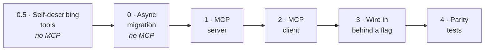

# Plan: filesystem tools over MCP

Moving the reviewer's three repository tools — `grep`, `read_file`, `list_dir` —
out of the reviewer's process and behind an MCP server, while orchestration
(`dispatch_specialists`, the master loop) stays in-process.

**Why this split:** MCP earns its keep when a capability crosses an ownership
boundary and has more than one potential consumer. File access does — anything
might want it. `dispatch_specialists` does not: its only caller is the master
agent running in the process next door, which ships in the same package.

---

## Phase order



Each phase leaves the tool working and the suite green. Phases 0.5 and 0 contain
no MCP code at all — they remove reasons the swap would otherwise be ambiguous.

**Baseline before you start:** 32 tests passing.

---

## Phase 0.5 — Make the tool layer self-describing

**Goal:** the prompt says *what to look for*; the tool schema says *what you can
do*. Nothing hardcodes a tool name.

**Why first:** `prompts/security.md:9` currently names `grep_tool`,
`read_file_tool`, `list_dir_tool` in prose. It previously named `grep_code` — a
tool that never existed — and nothing caught it, because prompts and tool
registrations drift independently. MCP makes this worse, not better: `tools/list`
is *dynamic discovery*, and a prompt that hardcodes names defeats it.

**MCP concepts:** none yet. This is preparation.

### Steps

1. **Strip tool names from all four files in `prompts/`.** Instruct the method,
   not the inventory:
   > "Investigate callers and surrounding context with the repository tools
   > available to you to confirm whether a vulnerability is genuinely
   > exploitable."

2. **Rewrite the three docstrings in `tools.py:105-136`** so they carry the
   affordance the prompts no longer do. Today they say nothing about limits:

   | Tool | Undocumented constraint |
   |---|---|
   | `grep_tool` | caps at 50 matches (`_MAX_GREP_MATCHES`) |
   | `read_file_tool` | truncates at 2000 lines (`_MAX_READ_LINES`) |
   | all three | confined to the repo; `.git`, `.env`, `.ssh`, `.aws`, `.reviewer`, `node_modules` refused |

   This is not cosmetic. In the last real trace, `coding_standards` ran the
   *identical* grep twice (ts 121.5 and 123.2), then hit its budget at 9/8 calls
   and returned nothing. An agent that cannot see its constraints spends its
   budget discovering them.

3. **Add a guard test** asserting no file in `prompts/` mentions a tool name, so
   the drift cannot return.

### Checkpoint
- 32 tests + 1 new guard test pass
- A real review still produces findings (compare against the last trace)

**Blast radius:** 4 prompt files, 3 docstrings, 1 test. No logic changes.

---

## Phase 0 — Async migration

**Goal:** the specialist path runs on asyncio instead of threads.

**Why:** MCP client sessions are asyncio. You cannot cleanly drive one from four
sync worker threads — you would need a loop per thread or
`run_coroutine_threadsafe` gymnastics. This has to land before any client code.

**MCP concepts:** none yet, but this is the prerequisite that makes Phase 2
possible.

### Steps

| File | Change |
|---|---|
| `subagents/base.py` | `run_subagent_review` → `async def`, `await agent.ainvoke(...)` |
| `master.py` | `_execute_task` → async |
| `master.py` | `_run_batch`: `ThreadPoolExecutor` → `asyncio.gather` + `asyncio.Semaphore(MAX_FANOUT)` |
| `master.py` | `dispatch_specialists` → `async def`; `run_master_loop` → async, `await agent.ainvoke(...)` |
| `orchestrator.py` | `run_review` → async |
| `cli.py` | `asyncio.run(run_review(repo_root))` |

### Things that must not regress

- **Result order.** `asyncio.gather` preserves argument order, same as
  `executor.map` did. The trace and report stay deterministic.
- **Run isolation.** Each coroutine wrapped in a Task gets a *copy* of the
  context, so `_current_run` stays per-task — same guarantee threads gave, by a
  different mechanism. Worth an explicit test.
- **Tracer locking.** `Tracer._write` holds a `threading.Lock`. Never `await`
  inside it.

### Checkpoint
- All 32 tests pass unchanged — including `test_dispatch.py`'s barrier test,
  which must be converted to an asyncio barrier and still prove concurrency
- A real review still runs end to end

**Blast radius:** 4 files, concurrency model. Highest-risk phase. Do it alone.

---

## Phase 1 — The MCP server

**Goal:** a standalone MCP server exposing the three tools, testable without the
reviewer.

**MCP concepts:**
- `FastMCP` server construction
- tool registration and automatic JSON-Schema generation from type hints
- the `tools/list` and `tools/call` methods
- stdio transport and its framing
- server capabilities advertised during `initialize`

### Files

```
reviewer/fs_server/
    roots.py       RootRegistry — the allowlist
    server.py      FastMCP instance + 3 tools
    __main__.py    python -m reviewer.fs_server <root>
```

### Steps

1. **`roots.py` — the trust boundary.** Over MCP the repository path arrives
   from a *client*, not from a human typing a CLI flag. `tools.py` confines
   agents *inside* a root; nothing today constrains the root itself. Pin it at
   startup from `REVIEWER_ALLOWED_ROOTS` or argv, resolve and reject anything
   outside.

2. **`server.py` — wrap, do not reimplement.** Import `grep`, `read_file`,
   `list_dir` from `reviewer.tools` and call them. The sandbox
   (`_resolve_within`, deny-list, symlink checks, output caps) stays in one
   place, and the existing 10 tests in `test_tools.py` keep guarding it.

3. **Keep the model-facing schema identical.** Same tool names, same parameter
   names. With a single configured root, tools take no `repo` argument — the
   schema is byte-identical to what agents see today.

4. **Decide error semantics.** Today tools return `"error: path escapes..."` as
   an ordinary string, so the agent can recover and try something else. MCP has
   a first-class `isError` flag. Recommendation: keep returning text, so agent
   behaviour is unchanged; revisit once parity is proven.

### How to explore it by hand

```bash
npx @modelcontextprotocol/inspector .venv/bin/python -m reviewer.fs_server .
```

The Inspector gives you a UI over the running server: list the tools, read the
generated schemas, call them with arbitrary arguments, and watch the raw
JSON-RPC. This is the fastest way to build intuition for what the protocol
actually carries.

### Checkpoint
- `tools/list` returns three tools with correct schemas
- Each is callable through the Inspector
- Traversal, deny-list, and symlink attempts are refused *over the wire*

**Blast radius:** new package only. Nothing existing changes.

---

## Phase 2 — The MCP client

**Goal:** the reviewer opens a session to the server and turns its tools into
LangChain tools.

**MCP concepts:**
- client lifecycle: spawn transport → `ClientSession` → `initialize` handshake →
  capability negotiation
- concurrent requests over one session (JSON-RPC request ids make this normal)
- adapting protocol tools into a framework's tool interface

### Files

```
reviewer/fs_client.py    session lifecycle + tracing wrappers
```

### Steps

1. **Session management.** `stdio_client` → `ClientSession` → `initialize()` →
   `load_mcp_tools(session)`. One session per review, shared by all specialists;
   an async context manager tied to the review's lifetime.

2. **Wrap each tool for tracing.** ← *the part that matters*

   Do **not** try to trace in the server — it has no idea which specialist is
   calling. Wrap each adapter-produced tool on the client so
   `tracer.tool_call(name, args, result)` fires inside the caller's context.
   Contextvars propagate through `asyncio.gather`, so run attribution keeps
   working with no run-ids in the wire protocol and no schema pollution.

   This is the orphaned-`run: null` bug from the last trace, prevented by design
   rather than rediscovered.

3. **Decide failure behaviour.** If the server dies mid-review, every in-flight
   specialist loses its tools. Recommendation: fail the batch loudly rather than
   silently falling back to in-process.

### Checkpoint
- A script opens a session, lists tools, calls one, and closes cleanly
- No orphaned subprocess after exit

**Blast radius:** new module. Still nothing existing changes.

---

## Phase 3 — Wire it in behind a flag

**Goal:** either backend, selectable, same behaviour.

### Steps

1. **Dependency injection.** `run_subagent_review` currently calls
   `make_repo_tools(repo_root)` itself. Change it to *accept* a tools list.
   `master.py` builds the tools once per review and passes them down. Cleaner
   and more testable regardless of MCP.

2. **Backend switch.** `REVIEWER_TOOLS_BACKEND=inproc|mcp`, defaulting to
   `inproc` until parity is proven.

3. **Server startup.** The reviewer spawns the server as a stdio subprocess for
   the duration of the review, rooted at the repo under review. ~0.5s spawn cost
   — negligible against a 141s review.

### Checkpoint
- `REVIEWER_TOOLS_BACKEND=inproc` — all tests pass, review works
- `REVIEWER_TOOLS_BACKEND=mcp` — same

**Blast radius:** 3 files, one signature change.

---

## Phase 4 — Parity tests

**Goal:** prove the swap changed the transport and nothing else.

| Test | Asserts |
|---|---|
| **Security parity** | replay `test_tools.py`'s traversal / deny-list / symlink cases *over the wire* — the sandbox holds through the protocol |
| **Tracing** | tool calls still attach to their run; two concurrent specialists don't blend |
| **Backend parity** | same inputs → same outputs, both backends |
| **stdout discipline** | the library never writes to stdout — stdio transport owns it |

Use `mcp.shared.memory.create_connected_server_and_client_session` to test the
server without spawning subprocesses. Keep one subprocess test for the real
stdio path.

The parity test is only meaningful because Phase 0.5 stopped the behaviour from
moving first.

---

## Environment

Already installed in `.venv`:

| Package | Version |
|---|---|
| `mcp` | 1.30.0 |
| `langchain-mcp-adapters` | 0.3.2 |

Add both to `pyproject.toml` as an optional extra (`[project.optional-dependencies] mcp`)
so the CLI does not grow a hard dependency.

## Config added along the way

| Variable | Phase | Meaning |
|---|---|---|
| `REVIEWER_ALLOWED_ROOTS` | 1 | `os.pathsep`-separated roots the server may serve |
| `REVIEWER_TOOLS_BACKEND` | 3 | `inproc` (default) or `mcp` |

## Open questions

1. **Error semantics** — text (current agent behaviour) vs MCP `isError`
2. **Server death mid-review** — fail loudly vs fall back to in-process
3. **Session granularity** — one shared session (planned) vs one per specialist
