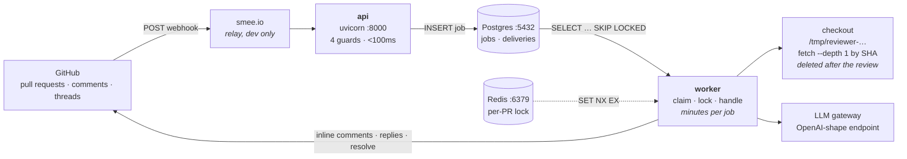
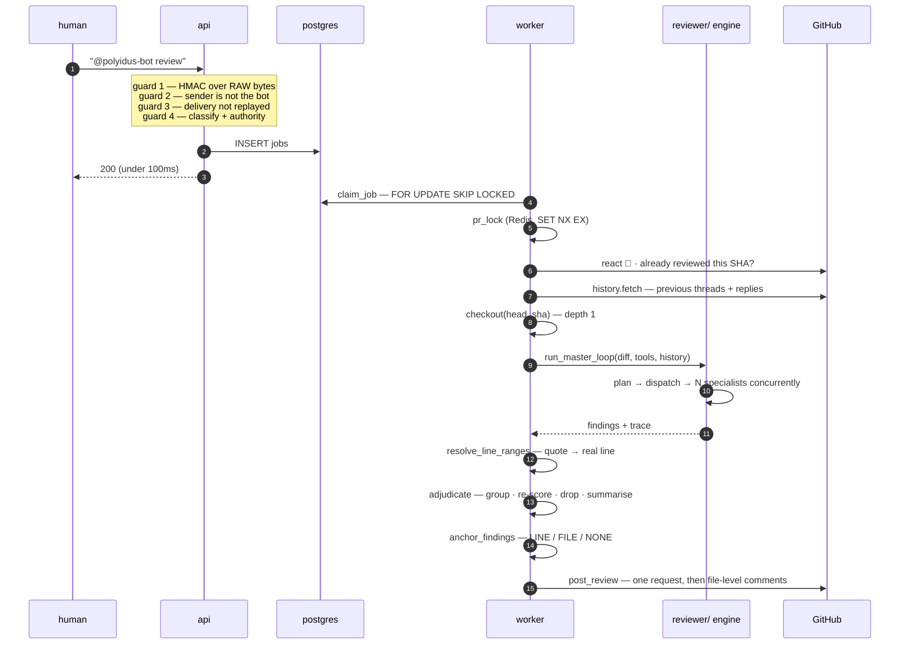
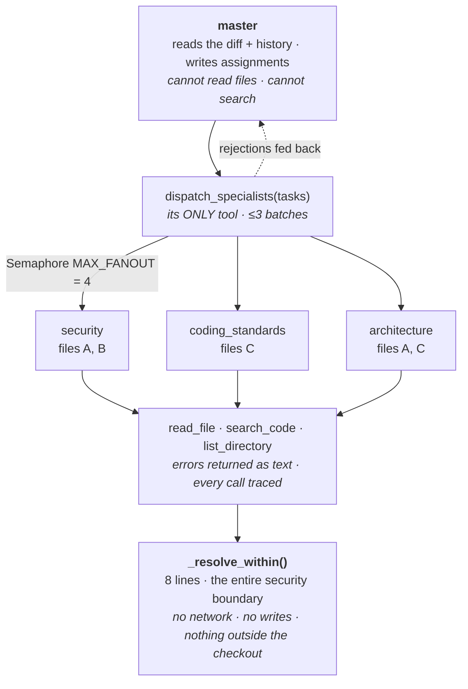
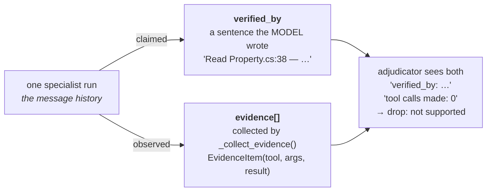
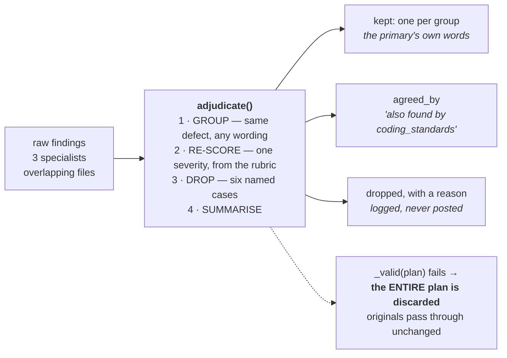
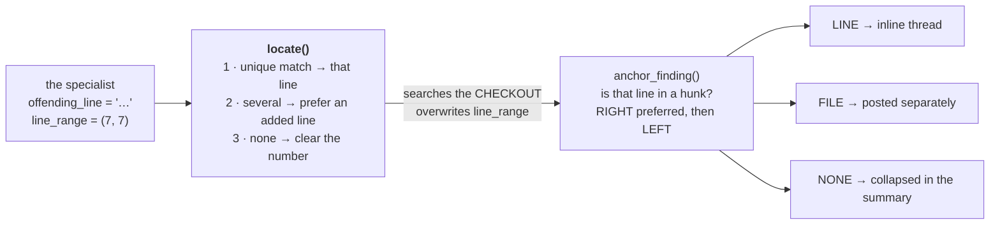
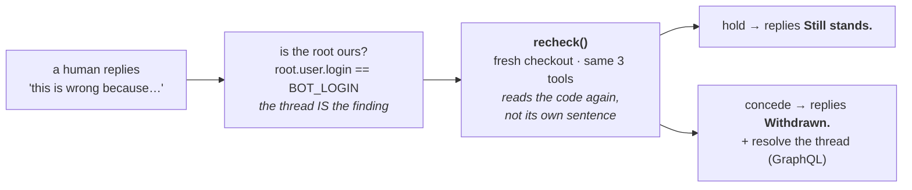

# polyidus-reviewer

A GitHub App that reviews pull requests when someone tags it, posts every
finding as an inline comment on the line it concerns, and answers people who
reply saying a finding is wrong.

```
reviewer/   the engine — a diff goes in, findings come out. Knows nothing about GitHub.
bot/        the GitHub App — webhooks in, inline comments out. Knows nothing about reviewing.
```

You can read either half without the other. That split organises everything below.

| | |
|---|---|
| `reviewer/` | 1,813 lines |
| `bot/` | 2,947 lines |
| prompts | 408 lines |
| tests | 114 passing |

---

## The three sentences the whole system rests on

1. **The GitHub thread is the database.** A finding posted inline opens a
   thread, and a thread already has an id, a file, a line, ordered replies and
   a resolved flag. Postgres holds a job queue and nothing else.
2. **The repository is cloned, and specialists read the clone.** GitHub's
   `search_code` has no `ref` parameter, so it structurally cannot see a pull
   request's own code.
3. **Placement is computed from the diff, never asserted by a model.** The
   model copies the offending line; the code searches for it.

---

## 1 · Processes and stores



Two Python processes, two stores, one temp directory. The split exists because
**GitHub waits on the webhook connection and gives up after about ten seconds**,
while a review takes minutes.

> `docker-compose.yml` has `build: .` for `api` and `worker` but there is no
> Dockerfile, so compose starts only Postgres and Redis — run the two Python
> processes from `.venv` yourself. smee.io is a development relay; in
> production GitHub reaches the API directly.

---

## 2 · One review, end to end



Steps 1–4 finish in under 100 milliseconds. Steps 5–17 take minutes. **That
boundary is the reason Postgres is in this project at all.**

---

## 3 · The agent architecture



The master cannot review and the specialists cannot orchestrate. Every
specialist is **stateless**, so four can run at once — and so none of them can
tell a sibling it already read a file, which is the largest inefficiency in the
system.

---

## 4 · Evidence: two independent records



The model can write anything into `verified_by`. It **cannot** write anything
into `evidence` — that list is built by pairing each `tool_call` id with the
`ToolMessage` that answered it. So a finding asserting "I read the definition"
with an empty evidence list is visibly unsupported, and *"its `verified_by`
does not support what it claims"* is one of adjudication's six drop rules.

> Schema rule: **the diff itself is never valid evidence for `verified_by`.**

---

## 5 · Adjudication

One real pull request produced **14 findings describing 7 distinct problems**,
with the same `SaveChangesAsync` issue reported four times at three different
severities. Every one was factually correct — the review was accurate and
unreadable.



It has read the **findings**, never the **code** — so it may group, re-score,
drop and summarise, but it must never write a new claim or change a finding's
wording.

Every index must appear exactly once: as a primary, inside a group's
duplicates, or in dropped. A plan that loses or double-counts one is rejected
whole, because **losing a real finding to a failed merge is worse than showing
a duplicate.**

---

## 6 · Placement: from a quoted line to a thread



Measured on one run: `quoted 10 · agreed 9 · corrected 1 · no_line 0`. One
comment in ten would otherwise have pointed at the wrong line — and GitHub
would not have caught it, because it only rejects lines outside the diff
entirely.

> A file-level comment inside a batched review makes GitHub **422 the entire
> review** — `DraftPullRequestReviewComment` has no `subject_type`. That is why
> the two lists are posted by different calls.

---

## 7 · The dispute loop



The human is usually right — **but not automatically**. Their reason is
evidence, not an instruction: conceding on request would make every finding
fall to the first objection, including the correct ones.

Resolution is the one thing REST cannot do — `isResolved` lives on
`PullRequestReviewThread` in GraphQL only. That single gap is the entire reason
a second protocol appears in this codebase.

---

## Known defects

| # | Where | What | Status |
|---|---|---|---|
| 0 | `base.py` | `recursion_limit` assumes 2 graph steps per tool call; a run died at 50 calls against a 70 budget, and the raise loses the whole run | Phase 0 |
| 2 | `files.py:17` | `pom.xml` unreadable on every Java repo; `".xml"` blocks nothing | open |
| 3 | `recheck.py:121` | `exit_behavior="end"` at 12 calls — an exhausted dispute silently holds | open |
| 4 | `local_tools.py` | no shared read cache — 63 reads across ~30 distinct files | open |
| 5 | `config.py` | code defaults disagree with `.env.example` (50 vs 8, 70 vs 15) | open |
| 6 | `tracer.py` | singleton never resets — the 2nd review in a worker re-renders the 1st's tree and reports elapsed since process start | open |
| 7 | `diff_context.py` | `slice_diff` silently widens a fully mis-scoped task to the whole diff | open |
| 9 | `files.py` | ripgrep and the Python fallback return **different results** — `rg` honours `.gitignore`, the walk does not | new |

---

## Running it

```bash
docker compose up -d postgres redis          # the two stores
.venv/bin/uvicorn bot.api:app --port 8000    # terminal 1
.venv/bin/python -m bot.worker               # terminal 2
npx smee-client --url $SMEE_URL --path /webhook --port 8000   # terminal 3
```

Then comment `@polyidus-bot review` on a pull request in a repository the App
is installed on.

| Variable | Effect |
|---|---|
| `REVIEWER_LLM=claude` | swap the backend to a local CLIProxyAPI (see `cliproxy/README.md`) |
| `BOT_DRY_RUN=1` | print every comment instead of posting it |
| `@polyidus-bot review force` | re-review a commit already reviewed |

---

## Further reading

| Document | What it covers |
|---|---|
| [`docs/CODEBASE.md`](docs/CODEBASE.md) | the file-by-file map |
| [`docs/LEARNINGS.md`](docs/LEARNINGS.md) | the design decisions and what each one cost to learn |
| [`docs/FINDINGS.md`](docs/FINDINGS.md) | the defect list in full, with evidence |
| [`docs/OPTIMIZATION_PLAN.md`](docs/OPTIMIZATION_PLAN.md) | the ordered work, and the baseline to measure against |
| [`docs/BOT_GUIDE.md`](docs/BOT_GUIDE.md) | setup, troubleshooting, and the GitHub App itself |
